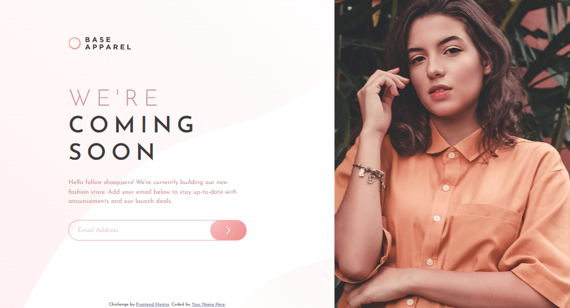
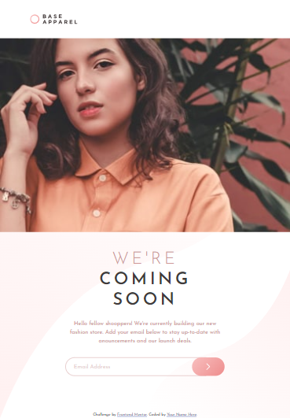
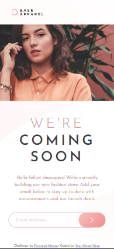

# Frontend Mentor - Base Apparel coming soon page solution

This is a solution to the [Base Apparel coming soon page challenge on Frontend Mentor](https://www.frontendmentor.io/challenges/base-apparel-coming-soon-page-5d46b47f8db8a7063f9331a0). Frontend Mentor challenges help you improve your coding skills by building realistic projects. 

## Table of contents

- [Overview](#overview)
  - [The challenge](#the-challenge)
  - [Screenshot](#screenshot)
  - [Links](#links)
- [My process](#my-process)
  - [Built with](#built-with)
  - [What I learned](#what-i-learned)
  - [Useful resources](#useful-resources)
- [Acknowledgments](#acknowledgments)

## Overview

### The challenge

Users should be able to:

- View the optimal layout for the site depending on their device's screen size
- See hover states for all interactive elements on the page
- Receive an error message when the `form` is submitted if:
  - The `input` field is empty
  - The email address is not formatted correctly

### Screenshot







### Links

- Solution URL: [Solution](https://github.com/NJVS/Base-Apparel-coming-soon-page.git)
- Live Site URL: [Live](https://njvs.github.io/Base-Apparel-coming-soon-page/)

## My process

### Built with

- Semantic HTML5 markup
- CSS custom properties
- [SASS/SCSS](https://sass-lang.com) - CSS with superpower
- Flexbox
- CSS Grid
- Responsive Web Design
- Vanilla Javascript

### What I learned

I use CSS Grid (grid-template-areas) for positioning the main elements. Im not sure if I do this right LOL.

```html
<main>
  <header>...<header>
  <div class="hero">...</div>
  <div class="content">...</div>
  <footer>...</footer>
</main>
```

```scss
main {
  position: relative;
  width: 100%;
  min-height: 100vh;
  background: url(../images/bg-pattern-desktop.svg) no-repeat;
  background-position: left;
  background-size: 75%;

  display: grid;
  grid-template-columns: 1fr auto;
  grid-template-rows: 0.4fr 1fr auto;
  grid-template-areas:
    "header hero"
    "content hero"
    "footer hero";

  @media (max-width: var.$resTablet) {
    background-position: bottom;
    background-size: 100%;

    grid-template-columns: 1fr;
    grid-template-rows: auto auto 1fr auto;
    grid-template-areas: 
      "header"
      "hero"
      "content"
      "footer";
  }
  @media (max-width: var.$resMobile) {
    background-size: cover;
  }
}
```

For the image to be responsive, I discovered "picture" tag. Before I use "srcset" and "size" attribute to switch the image on different resolution. Comparing the two, the "picture" tag is more readable and easy to use. *mind-blowned*

```html
<picture>
  <source media="(max-width: 912px)" srcset="./images/hero-mobile.jpg">
  
</picture>
```

For the form validation, I've disabled the built-in HTML validation and do it using JS by using regex and test() method. I also add an event on the input element, this will remove the error message and icon if the user tried to input a new value.

```js
const inpEmail = document.querySelector('input#email');
const regex = /^\w+([\.-]?\w+)*@\w+([\.-]?\w+)*(\.\w{2,3})+$/;

document.querySelector('form').addEventListener('submit', event => {

  if (!(regex.test(inpEmail.value))) {
    inpEmail.closest('.form-group').classList.add('err');
    event.preventDefault();
  }
});

inpEmail.addEventListener('input', () => inpEmail.closest('.form-group').classList.remove('err'));
```

### Useful resources

- [A Complete Guide to Grid](https://css-tricks.com/snippets/css/complete-guide-grid/) - I alway open this guide every time I use CSS Grid
- [A Complete Guide to Flexbox](https://css-tricks.com/snippets/css/a-guide-to-flexbox/) - This is for CSS Flexbox
- [Frontend Mentor](https://www.frontendmentor.io) - If you also want to try this and other web development challenges.

## Acknowledgments

This is actually my 2nd attemp for this challenge, I YOLO'd the first one and just submit the solution. I'm not satisfied with the result and restart the challenge.
